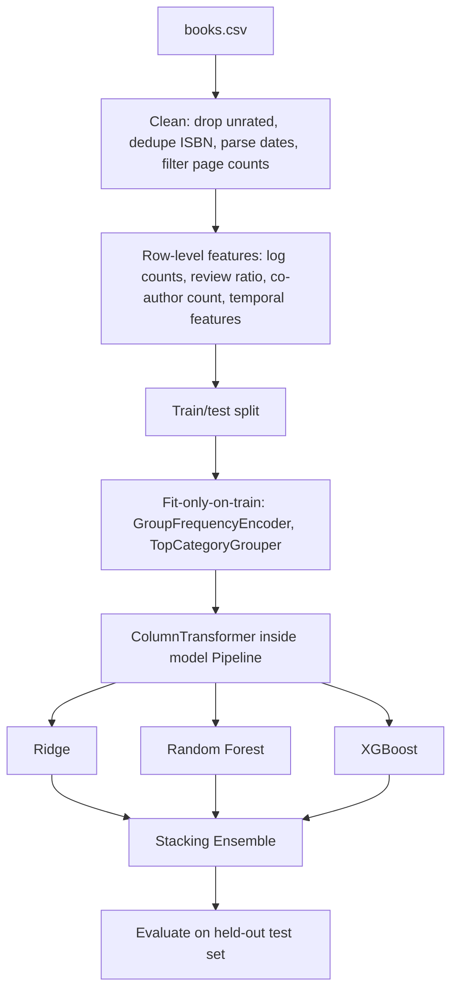

# 📚 Book Average Rating Prediction


A regression pipeline that predicts a book's Goodreads `average_rating` from its metadata, built with a fold-safe preprocessing design so no statistic computed from the test set ever reaches training.

## 🧠 Why This Exists

Most public notebooks on this dataset compute author and publisher frequency features once, over the entire dataset, before splitting into train and test. That single line silently leaks the test set's author and publisher composition into every training row and into every cross-validation fold during hyperparameter search.

This project treats that as a bug, not a detail. Every group-level statistic here — author frequency, publisher frequency, language bucketing — is learned inside a `scikit-learn` pipeline that `GridSearchCV` refits per fold, so the reported R² is the number the model would actually see in production, not an inflated one.

- **Fold-safe group encoding** via a custom `GroupFrequencyEncoder`, fit only on training folds
- **Leakage-free language bucketing** via a custom `TopCategoryGrouper`, top-N learned from training data only
- **Four models compared** on identical, leakage-free features: Ridge, Random Forest, XGBoost, Stacking Ensemble
- **Honest reporting**: R² sits around 0.16, reflecting how little of a book's rating is explained by page count, publisher, author volume, and language alone

## 🚀 Quickstart

```bash
git clone <repo-url>
cd book-rating-prediction
pip install -r requirements.txt
jupyter notebook book_rating_prediction.ipynb
```

Run all cells top to bottom. The notebook reads `data/books.csv` relative to its own location.

## 🏗️ Architecture

**Stack**: pandas, NumPy, scikit-learn, XGBoost, matplotlib, seaborn.



The split happens before any group-level statistic is computed. Author frequency, publisher frequency, and language-code bucketing all live inside `ColumnTransformer` steps nested in each model's `Pipeline`, so `GridSearchCV` recomputes them fresh on every training fold and applies the fold's own learned values to that fold's validation rows.

## 📊 Data & Model Details

**Dataset**: Goodreads books metadata, 11,123 rows, 12 raw columns. After cleaning (dropping unrated books, duplicate ISBNs, unparseable dates, and implausible page counts), 11,015 rows remain.

**Features**: 8 row-level numeric features (page count, log-transformed rating/review counts, review ratio, publication year/month, book age, co-author count) plus fold-safe author frequency, publisher frequency, and one-hot encoded language group.

| Model | RMSE | MAE | R² |
|---|---|---|---|
| Ridge | 0.2885 | 0.2160 | 0.0727 |
| Random Forest | 0.2754 | 0.2026 | 0.1546 |
| XGBoost | 0.2750 | 0.2047 | 0.1571 |
| **Stacking Ensemble** | **0.2743** | **0.2037** | **0.1614** |

The Stacking Ensemble is the best performer, but every model tops out under R² = 0.17. Metadata alone — pages, publisher size, author volume, language — explains a small slice of what drives a book's average rating; reader taste and content quality, which aren't in this dataset, dominate.

## 📁 Repository Structure

```
book-rating-prediction/
├── book_rating_prediction.ipynb
├── data/
│   └── books.csv
├── requirements.txt
└── README.md
```

## 🤝 Contribution & License

Issues and PRs welcome. Licensed under MIT.
